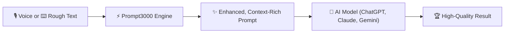

# Prompt3000 🚀

> **Turn messy thoughts into high-performing AI prompts — effortlessly.**  
> Skip the tedious typing with intelligent voice shortcuts and instant prompt enhancement, delivered directly to your favorite browser.

---

## 🌟 Overview

**Prompt3000** is an upcoming cross-browser extension designed to bridge the gap between user intent and peak AI performance. Instead of spending time manually crafting complex system prompts, instructions, and constraints, Prompt3000 does the heavy lifting for you.

Simply speak your ideas or type a rough note, tap a shortcut, and Prompt3000 transforms it into a structured, highly effective prompt optimized for models like ChatGPT, Claude, Gemini, Perplexity, and more.

---

## ✨ Key Features

### ⚡ Automatic Prompt Enhancement
- **From Rough to Refined**: Turns one-liners, bullet points, or vague thoughts into detailed, role-specified, and context-rich prompts.
- **Model-Aware Optimization**: Formats prompts with persona, context, goal, constraints, and output specifications proven to generate superior AI responses.
- **Single-Click Insert**: Replaces or enhances the text directly in the active input field.

### 🎙️ Voice-First Workflow ("Skip Typing")
- **Instant Voice Shortcut**: Press a customizable hotkey to activate voice capture instantly.
- **Natural Speech to Structured Prompt**: Talk naturally, ramble, or brainstorm aloud. Prompt3000 cleans up filler words, structures your intent, and outputs a refined prompt without touching your keyboard.
- **Frictionless Experience**: Saves time and eliminates cognitive fatigue from drafting lengthy prompts manually.

### 🌐 Cross-Browser Engine Support (Coming Soon)
Prompt3000 is built on modern WebExtension standards (Manifest V3) and will soon be available across all major web browsers:
- 🟢 **Google Chrome**
- 🟠 **Mozilla Firefox**
- 🦁 **Brave Browser**
- 🔵 **Microsoft Edge**
- 🔴 **Opera & Vivaldi**

---

## 🔄 How It Works



1. **Input**: Speak into your mic or type a quick rough note in any AI chat box.
2. **Trigger**: Use the shortcut (or click the floating Prompt3000 widget).
3. **Enhance**: Prompt3000 optimizes clarity, defines task parameters, adds examples/structure, and injects context.
4. **Output**: Your AI model receives an optimal prompt and provides dramatically better answers.

---

## 🎯 Target AI Platforms (LLM-Exclusive Scoping)

For optimal privacy, performance, and a clean browsing experience, Prompt3000 is intentionally restricted to activate **only on dedicated LLM websites** (it will never inject or run on regular websites):
- **OpenAI ChatGPT** (`chatgpt.com`, `chat.openai.com`)
- **Anthropic Claude** (`claude.ai`)
- **Google Gemini & AI Studio** (`gemini.google.com`, `aistudio.google.com`)
- **Perplexity AI** (`perplexity.ai`)
- **DeepSeek** (`deepseek.com`, `chat.deepseek.com`)
- **Microsoft Copilot** (`copilot.microsoft.com`)
- **Mistral Le Chat** (`chat.mistral.ai`)
- **Grok / xAI** (`grok.com`, `x.com/i/grok`)
- **Poe** (`poe.com`)
- **Phind** (`phind.com`)
- **HuggingChat** (`huggingface.co/chat`)
- **v0 by Vercel** (`v0.dev`)

---

## 🗺️ Roadmap & Upcoming Releases

- [ ] **Phase 1: Core Extension Architecture & Hotkey Integration**
- [ ] **Phase 2: Voice Input & Speech-to-Prompt Engine**
- [ ] **Phase 3: Prompt Enhancement & Template Personalization**
- [ ] **Phase 4: Store Releases**
  - [ ] Chrome Web Store
  - [ ] Firefox Add-ons (AMO)
  - [ ] Brave / Edge Extension Stores
- [ ] **Phase 5: Custom Prompt Profiles & Team Sync**

---

## 💻 Development & Contribution

### Prerequisites
- Node.js (v18+)
- npm / pnpm / yarn

### Getting Started (Local Development)

```bash
# Clone the repository
git clone https://github.com/xikiu/Prompt3000.git
cd Prompt3000

# Install dependencies
npm install

# Start development server with live reload
npm run dev              # Targets Chrome (Chromium/Brave/Edge)
npm run dev:firefox      # Targets Firefox
npm run dev:safari       # Targets Safari

# Build production extensions
npm run build            # Chrome MV3 (.output/chrome-mv3)
npm run build:firefox    # Firefox MV2/MV3 (.output/firefox-mv2)
npm run build:safari     # Safari WebExtension (.output/safari-mv2)

# Type check
npm run compile
```

### Loading the Extension in Browsers

1. **Google Chrome / Brave / Edge**:
   - Navigate to `chrome://extensions/`
   - Enable **Developer mode** (top right)
   - Click **Load unpacked** and select the `.output/chrome-mv3` folder.

2. **Mozilla Firefox**:
   - Navigate to `about:debugging#/runtime/this-firefox`
   - Click **Load Temporary Add-on...**
   - Select `manifest.json` inside the `.output/firefox-mv2` folder.

3. **Apple Safari**:
   - **Step 1**: In Safari, open **Settings (`⌘,`) > Advanced** and check **"Show features for web developers"**.
   - **Step 2**: In the menu bar under **Develop**, check **"Allow Unsigned Extensions"**.
   - **Step 3**: Run the app:
     ```bash
     npm run build:safari:app
     npm run run:safari
     # or open in Xcode: npm run open:safari
     ```
   - **Step 4**: Go to **Safari > Settings > Extensions** and check the box next to **Prompt3000**.

---

## 📄 License

This project is licensed under the [MIT License](LICENSE).
